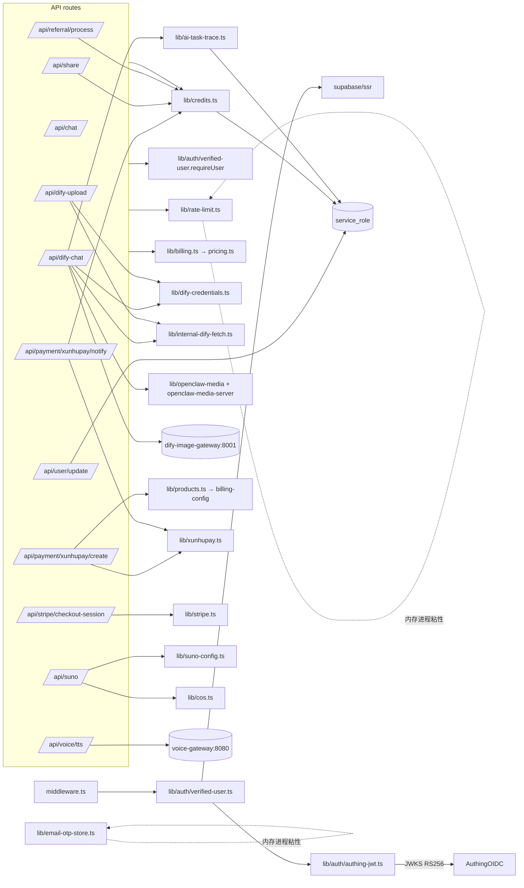

# lib/ 与 supabase/ 库层审计报告

> 范围：`lib/` 顶层 49 个 .ts、`lib/auth/`、`lib/supabase/`、`supabase/migrations/`、`hooks/`、`types/`、`services/`。
> 阅读策略：把每个模块归类到「鉴权 / 计费 / 媒体 / 第三方支付 / 上传 / OpenClaw / 文本工具 / SSE / Suno / 配置 / Util / 数据库 schema」中。

---

## 一、按模块审计

### 1) 鉴权与权限

#### `lib/auth/verified-user.ts` ✅
- 作用: 唯一可信的鉴权入口。先用 cookie/Bearer 走 `supabase.auth.getUser()`，失败再尝试 `verifyAuthingJwt`。
- 服务端：是。
- ⚠ 问题:
  - 与 `lib/auth-user.ts` 名字几乎相同但语义完全不同——`lib/auth-user.ts` 是「从乱七八糟的 user 对象里抽 id 字段」的工具。两者并存会让人误以为前者是用户身份提取器，但 *它没有任何鉴权*。建议把后者改名 `extract-user-id.ts` 或并入 `auth/`。
  - `assertSameUser` 仅返回布尔，没主动 throw 401，调用方容易忘记拒绝。

#### `lib/auth/authing-jwt.ts` ✅
- 作用: RS256 + JWKS 验签 Authing JWT。校验 iss/aud/exp/nbf/kid。
- ⚠ 问题:
  - JWKS 缓存 `JWKS_CACHE` 在进程内 10min；多实例集群会各自首次拉一次 JWKS——OK。
  - 直接调 `fetch(jwksUrl)`，未设超时；JWKS 端点抖动会拖慢登录。
  - `payload.aud` 仅匹配单字符串（数组也支持）；NextAuth 类常见的 `azp` 字段未校验。
  - 没有 leeway（时钟偏移）：`exp <= now` 严格判定，跨机时钟漂移可能误拒。

#### `lib/admin-auth.ts`
- 作用: 管理员 token 生命周期 + 审计。
- ⚠ 问题:
  - `${timestamp}:${Math.random()}` + `btoa` 当 token，**不是密码学安全**。改 `crypto.randomBytes(32).toString('base64url')`。
  - `useMemoryFallback` 全局粘住，多实例不一致。
  - `logAdminAction` 失败仅 console.error，没有备援。

#### `lib/permissions.ts`
- 作用: GPT Image 2 权限（订阅 / 邮箱白名单 / userId 白名单），抽象 membership status。
- ⚠ 问题:
  - 白名单从环境变量分两个 key 读 (`IMAGE2_WHITELIST_USER_IDS`/`IMAGE2_WHITELIST_EMAILS`/`GPT_IMAGE_2_ALLOWLIST`)，没有 trim 之外的清洗，也没去重。
  - `isSubscribedUser` 只识别 5 个 tier 字符串，新增等级要改两处（这里 + billing-config）。

#### `lib/auth-user.ts`
- 作用: 仅做 user 字段 fallback（id/sub/userId/user_id/nested user/data）。
- ⚠ 问题:
  - 这是导致大量「page.tsx 客户端用 phone/email 当 userId」反模式的根源；本身代码没问题，但作为公开 util 助长了不安全用法。建议私有化或加注释说明只能用于显示。

#### `lib/runtime-security.ts` ✅
- 仅 7 行，确保 `NODE_TLS_REJECT_UNAUTHORIZED !== '0'`。OK。

---

### 2) 计费 / 积分系统

#### `lib/billing-config.ts`
- 作用: 价格、积分包、产品目录、文本/媒体计费规则的唯一来源。
- ⚠ 问题:
  - 每条产品只有 monthly 价；年付通过 `× 12 × 0.8` 计算——硬编码折扣，不在产品目录上显示。
  - `MEDIA_BILLING` 与 `MODEL_COSTS` 在 `pricing.ts` 重复枚举模型，新增模型要改两处。
  - 配置版本只有一个常量字符串，没有 changelog，无回退能力。

#### `lib/pricing.ts` (514 行)
- 作用: token usage 解析、credit 计算、最低充值检测、输出 token 上限指令注入、高消耗审计判断。
- ⚠ 问题:
  - `MODEL_COSTS` 的 `displayName` 上有「Claude opus4.6thinking」「Gemini 3.1 pro」「ChatGPT 5.4」「Grok-4.2」**这些在真实供应商里都不存在**——是营销噱头。最好不要把这些假版本号同时放在面向后端的计费表里，免得审计混淆。
  - `parseDifyUsage` fallback 路径过多（5 种 usageSource），每种都可能让 user 被多扣或少扣 token，建议加测试覆盖。
  - `appendTextOutputLimitInstruction` 把指令拼到 query 末尾——会被 prompt 缓存、prompt injection 影响。
  - `validateProfitMargin()` 永远 `return true`，是坏味道占位。

#### `lib/billing.ts`
- 作用: `chargeCreditsSafely`（=`spendCredits` 别名）+ 审计 metadata 包装 + 估算 token 数量。
- ⚠ 问题:
  - 仅做参数转发；与 credits.ts 重复函数职责。

#### `lib/credits.ts` (667 行)
- 作用: service_role 直查 `user_credits / credit_transactions / referral_codes / referrals`；含 spend/add/getCredits/handleReferralSignup/getCreditTransactions/createUserReferralCode。
- ⚠ 问题:
  - **唯一具有「条件并发更新」实现的扣款函数**（`.eq("credits", credits.credits)` 配合 `.gte`）：好，但只对 spend 有效；`addCredits` 只做无条件 `update set credits = balanceAfter`——并发回调会丢更新（最后写者胜）。建议都用 `gen_random_uuid()` 抢占 + RPC 原子加。
  - `handleReferralSignup` 写完 referrals 表，再调 `addCredits`，**两步不在事务**；中间挂掉会出现 referrals 已记 + 积分未发的鬼数据。
  - `recordTransaction` 把 `billing_metadata` insert 失败时降级为基础字段——意味着审计字段可能丢；丢失记录无告警。
  - `addCredits` 在用户初次充值时会额外用 `is_pro: type === 'purchase'` 标记 `is_pro` true——逻辑藏在 catch 分支里，调用方无感知；`webhook 通过 createCredits` 与 xunhupay/notify 中的 `is_pro = isPro || currentCredits.is_pro` 又重复。
  - `console.log("[积分系统] ...")` 大量信息（含 userId、amount、reasons）落日志。

#### `lib/email-otp-store.ts` ❌（高风险已述）
- 进程内 Map + `console.log` 整张表；`canSend` 用 60s。
- 必须替换为 Redis/Supabase 表。

---

### 3) 速率限制 / CORS / 中间件

#### `lib/rate-limit.ts`
- 内存滑动窗口；优点：自带 `setInterval` 清理；缺点：多实例不共享。
- ⚠ 问题:
  - `getClientIP` 取 `x-forwarded-for` 第一个 IP——若反代未做 PROXY 头校验，可被前端伪造 IP 绕过限流。
  - `setInterval` 在 serverless cold start 上会被孤立掉（serverless 不会回收，但每个实例都开一个）。
  - `applyRateLimit` 默认 30/min 通用，但每个 route 里又写各自数字，配置散落。
  - `checkUserRateLimit` 固定 60/min 写死。

#### `lib/cors.ts`
- 严格白名单 5 个 origin，OK。
- ⚠ 问题:
  - `Access-Control-Allow-Headers` 默认包含 `X-User-Id`：暗示前端可以靠这个 header 鉴权——会让维护者误以为后端读 X-User-Id（实际不读）。建议删除。
  - `appendVary` 的实现遇到大小写差异时算正常（已 toLowerCase 比较）。

#### `lib/supabase/middleware.ts`
- `PROTECTED_API_ROUTES` 白名单只列 5 条；上文 API 审计已发现 `/api/chat`、`/api/share`、`/api/suno` 等多路由不在受保护清单里，所以中间件不会拒绝匿名请求；只能依赖 route 自己 require。
- 还允许「带 Bearer 但 supabase.getUser 失败 → 直接放行给路由」；意图是兼容 Authing token，但若路由忘了调 requireUser 就直接成为匿名通道。

#### `lib/supabase/server.ts` / `lib/supabase/client.ts` / `lib/supabase.ts`
- 三个文件三种 init 模式。`lib/supabase.ts` 还导出 `supabase.client` getter（懒加载），与 `lib/supabase/client.ts` 的 `createClient()` 单例并存，**重复且冲突**：page 中既看到 `import { supabase } from '@/lib/supabase'` 又看到 `import { createClient } from '@/lib/supabase/client'`。建议统一保留 `lib/supabase/`。

---

### 4) 第三方支付

#### `lib/stripe.ts` ✅
- 仅 7 行；`server-only`；`STRIPE_SECRET_KEY` 缺失则 `null`。OK。
- ⚠ 缺少 webhook handler，整个项目没有把 Stripe 已支付订单转成积分的路径。

#### `lib/xunhupay.ts`
- 作用: MD5 签名 + URL 拼接付款链接。
- ⚠ 问题:
  - `console.log("[迅虎支付签名验证] >>>>> 收到完整参数:", JSON.stringify(params))`——回调全量打印，泄露金额/订单号/sign。需删。
  - `xunhupayConfig` 在模块顶层 `const` 读 env，serverless 启动时若未配置返回空字符串签名将永远失败，但运行时不报警。
  - `total_fee` 用字符串字段直接拼签名，依赖前端保证 2 位小数；幸好 `notify` 那边按整数 cent 比对。

#### `lib/wechat-pay.ts`
- 作用: 微信支付（NATIVE）签名 + verifyNotify 占位。
- ⚠ 问题:
  - **完全是 demo 实现**：`createOrder` 只生成 sign，**根本没调用 `https://api.mch.weixin.qq.com/pay/unifiedorder`**；`createWeChatPayOrder` 直接拼 `weixin://wxpay/bizpayurl?pr=${out_trade_no}` 当 codeUrl 返回，二维码是无效的。
  - `MD5` + Body 用纯文本 key 做签名——v2 微信支付，已经被官方推荐升级到 v3（X.509 + AES）。
  - 整个 wechat-pay 流程实际上没人能成功支付（除非走 xunhupay 的微信通道）；该模块在生产是死代码。

---

### 5) 媒体 & OpenClaw

#### `lib/cos.ts`
- 作用: 腾讯云 COS 上传（内网 endpoint） + URL → CDN 重写。
- ⚠ 问题:
  - 输入 `sourceUrl` 不做白名单/SSRF 校验：`uploadToCos(sourceUrl)` 任意 HTTPS 都会被服务端 fetch + 写桶。被传 `http://169.254.169.254/...` 即触发 SSRF（虽然 sourceUrl 一般来自 Suno/Banana，但下游若可控就可放大）。
  - `console.log` 把每次上传 URL/Key 全打印；无脱敏。
  - `rewriteDifyResponseUrls` 递归替换字符串值，对 `cos-` / `tencentcos` 子串做替换——若用户文本里恰好出现这两个子串会被错改。
  - SDK 实例为模块单例（`cosInstance`）+ keep-alive，重启周期内不会重新读取 env，env 改动需要重启。

#### `lib/openclaw-media-server.ts`
- 作用: 用 HMAC-SHA256 给 OpenClaw 媒体路径签名。
- ⚠ 问题:
  - `getSigningSecret` 优先用 `OPENCLAW_MEDIA_SIGNING_SECRET`，否则**回退到 `NEXT_SERVER_ACTIONS_ENCRYPTION_KEY` 或 `SUPABASE_SERVICE_ROLE_KEY`**——把数据库写权限的 key 当签名 secret，泄露面横向放大。
  - `verifySignedOpenClawMediaPath` 用 `timingSafeEqual`，OK。
  - **签名机制本身完整，但配套的 `/api/openclaw-media-sign` 公开签发任何 path 的签名 URL（见 API 审计），等于自废武功。**

#### `lib/openclaw-media.ts`
- 作用: 把 OpenClaw 内部路径（`http://43.154.111.156:18789/__openclaw__/media/...` 与 `/home/node/.openclaw/media/...`）改写为公开签名 URL；判断附件类型。
- ⚠ 问题:
  - **正则里硬编码生产服务器 IP**「43.154.111.156」「18789」「shenxiang.school」等，IP 漂移即失效。
  - 如果 LLM 输出文本被恶意包含 `https://shenxiang.school/__openclaw__/media/../etc/passwd`，`encodePathSegments` 用 `decodeURIComponent` + `encodeURIComponent`——会还原为 `..` 然后再编码成 `%2E%2E`，路径遍历应该被服务端 `resolveMediaPath` 兜住，但是这条改写不是路径校验。

#### `lib/openclaw-html.ts` ✅
- 提取 OpenClaw HTML 主图。OK。

---

### 6) 文本工具 / SSE / SUNO / Vocab

#### `lib/text-sanitizer.ts`
- 作用: 清洗 LLM 输出的双转义、LaTeX 双反斜杠等。
- ⚠ 问题:
  - 大量正则替换有先后依赖；若新模型版本改变转义习惯，会双转义清洗过头。
  - 没有单元测试覆盖（仓库没看到）。

#### `lib/internal-dify-fetch.ts` ✅
- undici Agent for 内网 hostname；其他走默认 fetch。OK。
- ⚠ 注意: `INTERNAL_HOSTS` 写死 `docker-api-1 / dify-image-gateway / localhost / 127.0.0.1`；新增内网 svc 名时要更新。

#### `lib/dify-credentials.ts` ✅
- 按模型分发 API Key；`general-chat` 在生产强制要求专用 key。OK。

#### `lib/dify-types.ts` / `lib/sse-types.ts` ✅
- 类型定义；sse-types 大量 re-export，OK。

#### `lib/suno-config.ts` / `lib/suno-service.ts`
- Suno 端点 + 5s/60 次 轮询 + 双曲目状态。
- ⚠ 问题:
  - `SUNO_API_BASE_URL` 默认 `http://43.154.111.156/v1` —— **明文 HTTP + 公网 IP**。
  - Task ID 用纯 UUID 正则匹配，万一 LLM 文案内含 UUID 会误命中。

#### `lib/voice-service.ts` (前端) / `lib/voice-tts-request.ts` ✅
- 浏览器 MediaRecorder 录音；正常实现。

#### `lib/vocab-card-workflow.ts` / `lib/word-card-normalizer.ts`
- 词境记忆卡的输入构造 + 输出归一化。
- ⚠ 问题: 类型大量 `any`，逻辑分散在两个文件且互相调用，容易出现解析两套不一致。

---

### 7) AI 任务追踪 & 上传

#### `lib/ai-task-trace.ts`
- 作用: 把 task run 写到 `ai_task_runs` 表（含 node_events / artifacts），含 sanitize（屏蔽 Bearer/sk-/eyJ.../api_key=...）。
- ⚠ 问题:
  - `taskTableAvailable` 全局粘住，一次失败后整个进程不再尝试写入。
  - `sanitizeForTrace` 仅 4 个正则 + 字段名关键字；不会捕获自定义 secret 命名。
  - `extractArtifactsFromText` 用 `https?://[^\s)"'<>``]+` 提取 URL，会把用户文本中无关链接收为 artifact。

#### `lib/storage.ts`
- 作用: Vercel Blob 上传（旧路径）。
- ⚠ 问题:
  - 仍使用 `@vercel/blob`，但项目已切到自托管 + 腾讯云 COS。这是一份「跨云」的死路径——除非 `BLOB_READ_WRITE_TOKEN` 配了，否则 `put()` 会抛。

#### `lib/upload-service.ts`
- 作用: 前端文件大小 / 类型校验工具。
- ⚠ 问题: 与 `app/api/dify-upload` 中的服务端校验逻辑重复，两边白名单可能 drift；需要单一来源。

---

### 8) 配置 & UI 工具

#### `lib/beta-config.ts`
- 公测开关，OK。⚠ 标志 `wechatPay: false` 但 `lib/wechat-pay.ts` 仍存在；`alipay: false` 但 xunhupay 涵盖支付宝；前后端展示口径要靠这个 config 全局控制。

#### `lib/api-config.ts` / `lib/health-response.ts` / `lib/utils.ts` / `lib/app-chrome-routes.ts`
- 都是简单 util，OK。

#### `lib/chat-session-routes.ts`
- 作用: 把 model 名 normalize 到 `gpt-image-2 / banana-2-pro / general-chat`，构造路由。
- ⚠ 问题:
  - `normalizeChatSessionModel` 兜底用 `(model || "general-chat").trim().replaceAll("_","-")`，再 `lower`——若 model 名用 mixed case 后端 model registry 不接受会丢。
  - 中文关键字（"图像生成 / 图像编辑 / 图片生成 / 香蕉"）做模型识别——侥幸又脆弱，session.title 含这些词就会被误判。

#### `lib/system-prompt.ts`
- 内置作文批改/初始问题 prompt 大段中文。OK，但建议外置成 prompts 目录管理（仓库已经有 `prompts/`）。

#### `lib/design-tokens.ts` / `lib/motion.ts` / `lib/latex-constants.ts` / `lib/latex-utils.ts` / `lib/workflow-visual-config.ts`
- 设计/运动/LaTeX/UI 配置。⚠ 大、重；没有 tree-shaking 的话会被打到 client bundle（被 about/help/privacy 等 use client 页面引用）。

---

### 9) 数据库与 RLS

`supabase/migrations/` 里**只有一份 SQL**：`003_admin_tables.sql`，建立 `admin_tokens` + `admin_actions`，并启用 RLS（policy 实际是 `USING (true) WITH CHECK (true)`，等于不限制——靠 service_role 绕 RLS 反而更危险，因为没有真正的策略）。

**仓库里没有 001/002/004+ 迁移文件**。意味着以下表完全在 Supabase 控制台里手动创建：
- `user_profiles`、`user_credits`、`credit_transactions`
- `orders`
- `referral_codes`、`referrals`
- `shared_content`、`share_reward_claims`
- `chat_sessions`、`chat_messages`、`uploaded_files`、`essay_reviews`
- `invite_codes`、`profiles`
- `ai_task_runs`

这意味着：
1. **没有 schema 版本控制**：迁移历史只能口口相传；新成员 setup 数据库无脚本可跑。
2. **RLS 策略不可见**：`/app/share/[id]/page.tsx`、`/app/invite/page.tsx`、`/app/settings/page.tsx`、`/app/credits/page.tsx` 等以 anon key 直查表的代码完全依赖 RLS——RLS 配置只能从 Supabase UI 看，审计困难。
3. 几乎所有写路径都用 `service_role` 跳过 RLS（admin/orders/users/stats/user-details、auth/sync、auth/verify-email-otp、share、share/claim-reward、referral/process、user/membership、user/transactions、user/credits、user/update、payment/xunhupay/create+notify、chat-session、save-message、dify-chat、suno）。等于把表权限收紧到 0，再让应用层重建权限——任何缺 `requireUser` 的接口都直接读写他人数据。

### 「数据库与 RLS 风险」总结

| 风险 | 描述 |
|---|---|
| 缺迁移版本 | 仓库没有 0001~0002 迁移；admin 表 policy 等价无策略；无法重现环境。 |
| 应用层鉴权脆弱 | `/api/chat`、`/api/share*`、`/api/referral/*`、`/api/suno`、`/api/user/update` 等用 service_role 但不校验请求者身份。 |
| 缺约束 | 看代码可知没有：`user_credits.credits >= 0` CHECK；`orders.status` enum；`shared_content.share_id` UNIQUE；`credit_transactions.amount` 整数 CHECK；`referrals (referrer_id, referee_id)` UNIQUE。这些只能靠应用层防御。 |
| 重复 schema | 既有 `profiles`（被 user/transactions 引用）又有 `user_profiles`（被 auth/sync 写入）：两套用户档案表并存。 |
| 软引用 | `shared_content.user_id`、`orders.user_id`、`credit_transactions.user_id` 都是 TEXT，不是 FK，跨身份系统（Supabase UUID vs Authing 24-hex）混用，容易出现 dangling 行。 |
| 隐藏字段 | `ai_task_runs.metadata / node_events / artifacts` 字段从未在迁移文件里出现；任何 API 都假设它们存在。 |

---

## 二、依赖关系图（关键模块）

---

## 三、跨模块横向问题

1. **凭据落地线索散在多处**：`localStorage` 同时存 supabase session、authing token、admin_token、currentUser；`supabase.ts` / `supabase/client.ts` 有重复实现；`lib/admin-auth.ts` 内存 fallback 与 supabase 表 fallback 共存；`lib/email-otp-store.ts` 也是进程内存。**应统一改为 httpOnly cookie + Redis（OTP 与 admin token）**。
2. **service_role 用法过度**：`credits / chat-session / save-message / save-essay-review / share / claim-reward / referral / payment / admin/* / user/* / dify-chat / suno / debug / cos` 全部 import `createClient(SUPABASE_SERVICE_ROLE_KEY)`。**任何一条 route 缺 `requireUser` 即 RLS 完全失效**。建议引入 `lib/supabase/admin.ts` 统一封装，并且导出函数不接受 raw userId，必须传 `VerifiedUser` 类型（编译期阻断身份伪造）。
3. **同名 / 重复模块**：
   - `lib/supabase.ts` vs `lib/supabase/client.ts` 都是浏览器 client 单例。
   - `lib/auth-user.ts`（字段抽取）vs `lib/auth/verified-user.ts`（鉴权）。
   - `lib/billing.ts`（包装层）vs `lib/credits.ts`（实现层）。
   - `lib/storage.ts`（Vercel Blob）vs `lib/cos.ts`（腾讯云 COS）vs `lib/upload-service.ts`（前端校验）。
4. **生产基础设施泄露**：`lib/openclaw-media.ts`、`lib/openclaw-media-server.ts`、`lib/suno-config.ts`、`lib/dify-credentials.ts`、`.env.example`、`AGENTS.md`、`CLAUDE.md` 多处把生产 IP `43.154.111.156` / `:8001` / `:18789` / 内部 hostname `dify-image-gateway` `voice-gateway` 写进源码或公开文档。
5. **错误处理不统一**：很多 fetch 没设超时（`xunhupay.ts queryXunhupayOrder` / `voice-service.ts` / `cos.ts uploadToCos` / `authing-jwt.ts fetchJwks`）。Suno、Dify 走 internalDifyFetch 控制超时，但其他外部 HTTP 调用都裸 fetch。
6. **日志噪音 + PII 泄露**：`lib/credits.ts`、`lib/email-otp-store.ts`、`lib/xunhupay.ts`、`lib/admin-auth.ts`、`lib/cos.ts`、`lib/ai-task-trace.ts` 都直接 console.log 用户/订单/积分/OTP。`lib/logger.ts` 已经存在但**没人用**，全仓库 90+ 处 `console.log`。
7. **微信支付死代码**：`lib/wechat-pay.ts` 是占位实现，但路径 `/payment/wechat/[orderNo]/page.tsx` 和 `/api/payment/wechat/create` 仍存在并被前端调用——若未来用户点击微信支付会走断路。
8. **TS `any`/松散类型**：`ai-task-trace`、`vocab-card-workflow`、`word-card-normalizer`、`dify-chat` 大量 `any`。
9. **配置中心散落**：模型注册（page 端 SUPPORTED_MODELS）、`lib/dify-credentials.ts` switch、`lib/pricing.ts MODEL_COSTS`、`lib/chat-session-routes.ts` normalize 表、组件 `workflow-visual-config.ts` —— 一个新增模型要改 5+ 处。
10. **没有 prompts 单元测试 / pricing 单元测试**：`prices/usage parser` 关乎金钱却 0 测试。
11. **schema 漂移**：仓库只有一份 `003_admin_tables.sql`，所有其他表都靠运营人员手动建。`debug/init-tables` 路由甚至会调用 `rpc('exec_sql')`——安全风险且不能进版本控制。
12. **CORS Allow-Headers 含 X-User-Id**，与代码实际身份语义矛盾，应删除。

